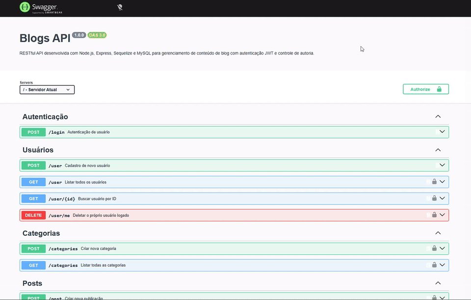
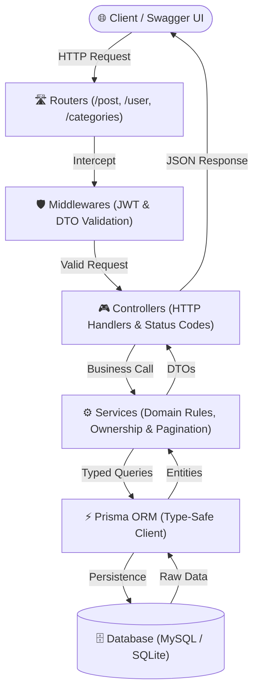
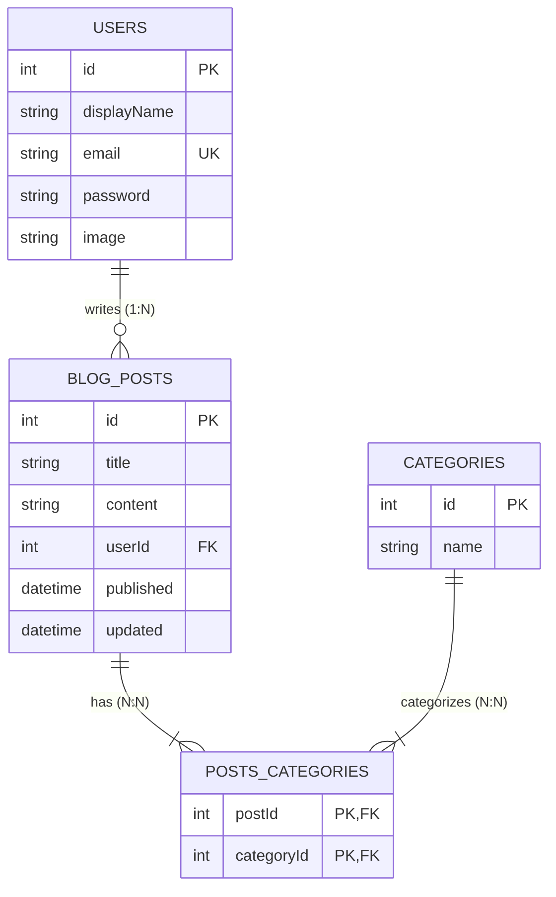

# Blogs API 📝

[](https://www.typescriptlang.org/)
[](https://nodejs.org/)
[](https://expressjs.com/)
[](https://www.prisma.io/)
[](https://www.mysql.com/)
[](https://www.sqlite.org/)
[](https://jwt.io/)
[](https://swagger.io/)
[](https://www.docker.com/)
[](https://opensource.org/licenses/MIT)

> 🇺🇸 **English** | 🇧🇷 [**Versão em Português**](README.md)

RESTful content management and publication API for blogs, built with Node.js, TypeScript, and a layered MSC (Model-Service-Controller) architecture. Features data persistence via Prisma ORM, stateless authentication and authorization using JWT, query pagination, relational text search, and an interactive Swagger UI (OpenAPI 3.0) documentation console.

## 📌 Quick Navigation

- [📝 About The Project](#-about-the-project)
- [🖼️ Preview](#️-preview)
- [🌐 Online Application Deploy & Swagger Demo](#-online-application-deploy--swagger-demo)
- [⚡ API Endpoints](#-api-endpoints)
- [✨ Key Features](#-key-features)
- [🛠️ Technologies and Tools](#️-technologies-and-tools)
- [🏛️ Solution Architecture](#️-solution-architecture)
- [📁 Repository Structure](#-repository-structure)
- [💡 Technical Decisions](#-technical-decisions)
- [🚀 Getting Started](#-getting-started)
- [📄 License](#-license)

## 📝 About The Project

**Blogs API** is an enterprise-grade backend solution that emulates an article and news publication platform. The system was designed adhering to modern software engineering patterns:

- **Layered MSC Architecture:** Strict isolation between HTTP routing, request validation, business rules, and data access layers.
- **End-to-End Type Safety:** Strict TypeScript contracts, explicit DTOs, and compiler-checked Prisma queries.
- **Stateless Authorization:** Token-based authentication using JWT and granular ownership validation to prevent unauthorized updates or deletions of user posts.
- **Dual Database Strategy:** Seamless support for MySQL in local/Docker development environments, alongside embedded SQLite for zero-cost, persistent cloud deployment on Render.

## 🖼️ Preview



## 🌐 Online Application Deploy & Swagger Demo

Experience the live application in production:  
👉 **[Blogs API - Swagger UI](https://project-blogs-api.onrender.com/api-docs/)**

> 💡 **Testing Tip:** The root URL (`https://project-blogs-api.onrender.com/`) automatically redirects to the Swagger dashboard. To test protected endpoints, authenticate through `POST /login` or register a new user in `POST /user`, copy the generated token, and supply it via the green **Authorize** button at the top of the interface.

## ⚡ API Endpoints

| Method | Endpoint | Protected | Description |
| :--- | :--- | :---: | :--- |
| `POST` | `/login` | ❌ | Authenticates user credentials and issues a JWT token |
| `POST` | `/user` | ❌ | Registers a new user account |
| `GET` | `/user` | ✅ | Retrieves all registered users (excluding passwords) |
| `GET` | `/user/:id` | ✅ | Fetches a specific user profile by ID |
| `DELETE` | `/user/me` | ✅ | Removes the currently authenticated user's account |
| `GET` | `/categories` | ✅ | Lists all available article categories |
| `POST` | `/categories` | ✅ | Registers a new category |
| `GET` | `/post` | ✅ | Fetches posts with authors & categories (supports `?page=1&limit=10`) |
| `GET` | `/post/:id` | ✅ | Retrieves single post details including associations |
| `GET` | `/post/search?q=query` | ✅ | Searches posts matching title or content text |
| `POST` | `/post` | ✅ | Creates a new publication linked to categories |
| `PUT` | `/post/:id` | ✅ | Modifies title/content (restricted to original author) |
| `DELETE` | `/post/:id` | ✅ | Deletes publication (restricted to original author) |

## ✨ Key Features

- **Authentication & Session Control:** Token creation and validation with HMAC-SHA256 and configurable lifespan.
- **Granular Authorship Control:** Service-level authorization verifying requester identities before allowing post modifications or deletions.
- **N:N Relational Mapping:** Posts and Categories association managed through pivot junction records with cascading deletions.
- **Resource Pagination:** Smart cursor/offset pagination on `GET /post` ensuring scalability over large datasets.
- **Flexible Text Search:** In-memory relational queries matching search terms across post titles and bodies.
- **CORS & Resilience:** Permissive Cross-Origin Resource Sharing and flexible token parsing supporting both raw and `Bearer ` prefixed strings.

## 🛠️ Technologies and Tools

| Layer / Purpose | Technology | Description |
| :--- | :--- | :--- |
| **Primary Language** | **TypeScript 5.6.3** | Strict compile-time checks, interfaces, and typed DTO contracts |
| **Runtime Environment** | **Node.js 18 LTS** | Fast, event-driven asynchronous JavaScript runtime on V8 engine |
| **Web Framework** | **Express.js 4.17** | Robust RESTful HTTP router, middleware pipeline, and controllers |
| **ORM & Data Layer** | **Prisma 5.22** | Type-safe declarative schema and auto-generated database client |
| **Databases** | **MySQL 8.0 & SQLite** | MySQL for local containerized setups; SQLite for low-overhead cloud deploy |
| **Auth & Security** | **JSON Web Token (JWT) & CORS** | Stateless token authentication and cross-origin resource sharing |
| **Documentation** | **Swagger UI / OpenAPI 3.0** | Interactive API specification and live testing playground at `/api-docs` |
| **Containerization** | **Docker & Docker Compose** | Reproducible multi-stage Alpine build and database orchestration |
| **Development Tooling** | **ts-node-dev** | In-memory hot-reload compilation during active development |

## 🏛️ Solution Architecture

The solution implements a decoupled MSC (Model-Service-Controller) architecture:



### Entity-Relationship Diagram (ERD):



## 📁 Repository Structure

```text
project-blogs-api/
├── prisma/
│   ├── schema.prisma          # Default MySQL schema
│   ├── schema.sqlite.prisma   # SQLite schema tailored for Render cloud deploy
│   └── seed.ts                # TypeScript database seed script
├── src/
│   ├── auth/                  # JWT generation & authentication middleware
│   ├── controllers/           # Express request handlers & HTTP responses
│   ├── docs/                  # OpenAPI 3.0 specification (swagger.json)
│   ├── middlewares/           # DTO input validations and error handling
│   ├── routers/               # HTTP route definitions
│   ├── services/              # Domain logic, authorship control & Prisma queries
│   ├── types/                 # Domain interfaces and DTO definitions
│   ├── app.ts                 # Express application setup with CORS & Swagger
│   ├── prisma.ts              # Centralized singleton PrismaClient instance
│   └── server.ts              # Server startup and port listening
├── Dockerfile                 # Multi-stage container definition (Node 18 Alpine)
├── docker-compose.yml         # Container orchestration for App + MySQL
├── tsconfig.json              # TypeScript compiler configuration
└── package.json               # Dependencies and execution scripts
```

## 💡 Technical Decisions

1. **Migration to TypeScript:** Drastically reduced runtime bugs by validating input payloads, query options, and entity structures directly at compile time.
2. **Adoption of Prisma ORM:** Replaced fragile string-based queries with fully auto-generated, type-safe queries that guarantee schema synchronization.
3. **Dual Database Configuration:** Retained MySQL via Docker Compose to reproduce real-world enterprise databases, while offering an automated SQLite pipeline for cloud deployment on platforms like Render without recurring database hosting costs.
4. **Flexible Bearer Parsing:** Handlers seamlessly extract tokens whether passed with a `Bearer ` prefix or as raw token strings.

## 🚀 Getting Started

### Prerequisites
- [Git](https://git-scm.com/)
- [Node.js](https://nodejs.org/) (v18+) and [npm](https://www.npmjs.com/)
- [Docker](https://www.docker.com/) and [Docker Compose](https://docs.docker.com/compose/) (optional, recommended)

### Option 1: Running with Docker Compose (MySQL)

1. Clone the repository:
   ```bash
   git clone https://github.com/ludson96/project-blogs-api.git
   cd project-blogs-api
   ```

2. Start the application and MySQL services:
   ```bash
   docker-compose up -d
   ```

3. Access the application:
   - **API & Swagger UI:** `http://localhost:3000/api-docs`
   - **MySQL Database:** port `3306`

### Option 2: Running Locally

1. Install dependencies:
   ```bash
   npm install
   ```

2. Set up environment variables:
   ```bash
   cp .env.example .env
   ```

3. Sync database schema and seed initial records:
   ```bash
   npm run prisma:push
   npm run prisma:seed
   ```

4. Launch the local development server:
   ```bash
   npm run dev
   ```

Access interactive documentation at `http://localhost:3000/api-docs`.

## 📄 License

This project is licensed under the [MIT License](https://opensource.org/licenses/MIT).

<div align="center">
  Developed by <strong>Ludson Pereira dos Santos</strong> 🚀<br />
  <a href="https://www.linkedin.com/in/ludson96/">LinkedIn</a> • <a href="https://github.com/ludson96">GitHub</a> • <a href="mailto:ludson_ps27@hotmail.com">Email</a>
</div>
