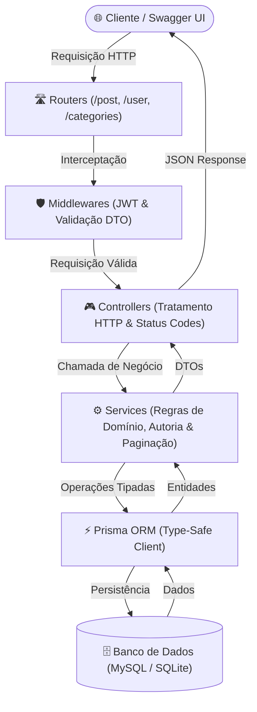
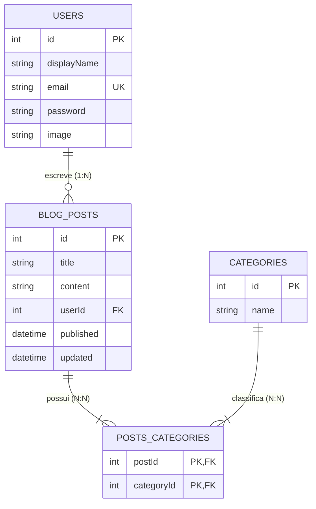

# Blogs API 📝

[](https://www.typescriptlang.org/)
[](https://nodejs.org/)
[](https://expressjs.com/)
[](https://www.prisma.io/)
[](https://www.mysql.com/)
[](https://www.sqlite.org/)
[](https://jwt.io/)
[](https://swagger.io/)
[](https://www.docker.com/)
[](https://opensource.org/licenses/MIT)

> 🇧🇷 **Português** | 🇺🇸 [**English Version**](README.en.md)

API RESTful de gerenciamento de conteúdo e publicações para blogs, construída em Node.js com TypeScript e arquitetura em camadas MSC. Conta com persistência via Prisma ORM, autenticação e autorização por tokens JWT, paginação inteligente de posts, busca textual com operadores relacionais e console de documentação interativa Swagger (OpenAPI 3.0).

## 📌 Navegação Rápida

- [📝 Sobre o Projeto](#-sobre-o-projeto)
- [🖼️ Preview](#️-preview)
- [🌐 Deploy da Aplicação & Demonstração Online do Swagger](#-deploy-da-aplicação--demonstração-online-do-swagger)
- [⚡ API Endpoints](#-api-endpoints)
- [✨ Funcionalidades](#-funcionalidades)
- [🛠️ Tecnologias e Ferramentas Utilizadas](#️-tecnologias-e-ferramentas-utilizadas)
- [🏛️ Arquitetura da Solução](#️-arquitetura-da-solução)
- [📁 Estrutura do Repositório](#-estrutura-do-repositório)
- [💡 Decisões Técnicas](#-decisões-técnicas)
- [🚀 Como Executar o Projeto](#-como-executar-o-projeto)
- [📄 Licença](#-licença)

## 📝 Sobre o Projeto

O **Blogs API** é uma solução backend profissional que simula uma plataforma de publicação de artigos e notícias. O projeto foi projetado com forte foco em boas práticas de engenharia de software:

- **Arquitetura em Camadas (MSC):** Isolamento entre camada de roteamento, controle de requisições, regras de negócio e camada de acesso aos dados.
- **Type-Safety de Ponta a Ponta:** Tipagem estrita com TypeScript, DTOs explícitos e autocompletion nativo com Prisma Client.
- **Segurança Stateless:** Emissão de tokens JWT na autenticação e verificação de propriedade de posts para garantir que apenas o autor original possa editar ou deletar publicações.
- **Ambiente Dual de Banco de Dados:** Suporte nativo para MySQL (desenvolvimento local e Docker) e SQLite integrado (deploy com zero custos e alta portabilidade em nuvem).

## 🖼️ Preview


## 🌐 Deploy da Aplicação & Demonstração Online do Swagger

Acesse a aplicação em produção:  
👉 **[Blogs API - Swagger UI](https://project-blogs-api.onrender.com/api-docs/)**

> 💡 **Dica de Teste:** O endpoint raiz (`https://project-blogs-api.onrender.com/`) redireciona automaticamente para o Swagger. Para testar rotas protegidas, faça login no endpoint `POST /login` ou crie uma conta em `POST /user`, copie o token gerado e informe no botão verde **Authorize** no topo do Swagger.

## ⚡ API Endpoints

| Método | Endpoint | Protegido | Descrição |
| :--- | :--- | :---: | :--- |
| `POST` | `/login` | ❌ | Autentica o usuário com email/senha e retorna token JWT |
| `POST` | `/user` | ❌ | Cria um novo usuário na plataforma |
| `GET` | `/user` | ✅ | Lista todos os usuários cadastrados (sem expor senhas) |
| `GET` | `/user/:id` | ✅ | Retorna o perfil de um usuário específico por ID |
| `DELETE` | `/user/me` | ✅ | Remove a própria conta do usuário autenticado |
| `GET` | `/categories` | ✅ | Lista todas as categorias de artigos |
| `POST` | `/categories` | ✅ | Cadastra uma nova categoria |
| `GET` | `/post` | ✅ | Lista publicações com autores e categorias (suporta `?page=1&limit=10`) |
| `GET` | `/post/:id` | ✅ | Detalhes de um post específico com associações |
| `GET` | `/post/search?q=termo` | ✅ | Busca posts por título ou conteúdo |
| `POST` | `/post` | ✅ | Cria uma nova publicação associada a categorias |
| `PUT` | `/post/:id` | ✅ | Edita título/conteúdo (autorização restrita ao autor) |
| `DELETE` | `/post/:id` | ✅ | Exclui publicação (autorização restrita ao autor) |

## ✨ Funcionalidades

- **Autenticação & Controle de Sessão:** Geração e validação de tokens JWT com expiração configurável.
- **Controle Fino de Autoria:** Verificação a nível de serviço impedindo que usuários modifiquem posts criados por outros autores.
- **Mapeamento Relacional N:N:** Relacionamento entre posts e categorias através de tabela associativa com deleção em cascata (`Cascade`).
- **Paginação de Recursos:** Endpoint `GET /post` otimizado para lidar com altos volumes de dados via query params `page` e `limit`.
- **Busca Textual Flexível:** Filtro em tempo real de publicações por correspondência de título ou conteúdo.
- **Tratamento de CORS & Resiliência:** Configuração de headers CORS permissivos para integração com SPAs e suporte dinâmico a tokens com ou sem prefixo `Bearer`.

## 🛠️ Tecnologias e Ferramentas Utilizadas

| Camada / Finalidade | Tecnologia | Descrição |
| :--- | :--- | :--- |
| **Linguagem Principal** | **TypeScript 5.6.3** | Tipagem estrita, interfaces de DTOs e maior previsibilidade em tempo de compilação |
| **Ambiente de Execução** | **Node.js 18 LTS** | Runtime JavaScript assíncrono e não bloqueante baseado na V8 |
| **Framework Web** | **Express.js 4.17** | Roteamento HTTP, pipeline de middlewares e modularização RESTful |
| **Persistência & ORM** | **Prisma 5.22** | Mapeamento relacional com type-safety em tempo de compilação |
| **Banco de Dados (Produção/Local)** | **MySQL 8.0 & SQLite** | MySQL conteinerizado no Docker e SQLite otimizado para deploy no Render |
| **Autenticação & Segurança** | **JSON Web Token (JWT) & CORS** | Validação stateless de identidade e controle de acesso a recursos entre origens |
| **Documentação Interativa** | **Swagger UI / OpenAPI 3.0** | Especificação viva e interface gráfica de execução de endpoints em `/api-docs` |
| **Containerização** | **Docker & Docker Compose** | Construção da aplicação e provisionamento do banco com uma única instrução |
| **Ambiente de Desenvolvimento** | **ts-node-dev** | Transpilação rápida na memória e hot-reload durante o desenvolvimento |

## 🏛️ Arquitetura da Solução

O projeto adota uma arquitetura em camadas estruturada e desacoplada, garantindo alta manutenibilidade:



### Relacionamento de Entidades (ER Diagram):



## 📁 Estrutura do Repositório

```text
project-blogs-api/
├── prisma/
│   ├── schema.prisma          # Schema padrão MySQL
│   ├── schema.sqlite.prisma   # Schema alternativo SQLite para deploy Render
│   └── seed.ts                # Seed inicial de dados em TypeScript
├── src/
│   ├── auth/                  # Lógica JWT e middlewares de autenticação
│   ├── controllers/           # Controladores Express (respostas HTTP)
│   ├── docs/                  # Especificação OpenAPI 3.0 (swagger.json)
│   ├── middlewares/           # Validações de entrada e tratamento de erros
│   ├── routers/               # Definição e agrupamento de rotas
│   ├── services/              # Camada de regras de negócio e consultas Prisma
│   ├── types/                 # Interfaces e DTOs da aplicação
│   ├── app.ts                 # Configuração do Express, CORS e Swagger
│   ├── prisma.ts              # Instância única e centralizada do PrismaClient
│   └── server.ts              # Ponto de entrada e inicialização do servidor
├── Dockerfile                 # Configuração de build conteinerizado (Node 18 Alpine)
├── docker-compose.yml         # Provisionamento da aplicação e do banco MySQL
├── tsconfig.json              # Configurações do compilador TypeScript
└── package.json               # Dependências e scripts de automação
```

## 💡 Decisões Técnicas

1. **Migração para TypeScript:** Eliminação de erros em tempo de execução, garantindo que contratos de DTOs entre Controller, Service e Banco sejam validados pelo compilador.
2. **Adoção do Prisma ORM:** Troca de modelos legados baseados em strings por um cliente unificado com tipagem estrita gerada a partir do schema declarativo.
3. **Estratégia de Banco Dual:** Mantido o MySQL com Docker Compose para simulação idêntica a ambientes corporativos, e adicionado suporte a SQLite no Dockerfile para disponibilização em nuvem sem custo de instâncias externas de banco.
4. **Tratamento de Tokens Flexível:** Middleware capaz de aceitar tokens com ou sem o prefixo `Bearer `, garantindo suporte tanto a clientes HTTP convencionais quanto à interface gráfica do Swagger.

## 🚀 Como Executar o Projeto

### Pré-requisitos
- [Git](https://git-scm.com/)
- [Node.js](https://nodejs.org/) (v18+) e [npm](https://www.npmjs.com/)
- [Docker](https://www.docker.com/) e [Docker Compose](https://docs.docker.com/compose/) (opcional, mas recomendado)

### Opção 1: Executando com Docker Compose (MySQL)

1. Clone o repositório:
   ```bash
   git clone https://github.com/ludson96/project-blogs-api.git
   cd project-blogs-api
   ```

2. Suba o container da aplicação e do banco de dados MySQL:
   ```bash
   docker-compose up -d
   ```

3. Acesse a aplicação:
   - **API e Swagger UI:** `http://localhost:3000/api-docs`
   - **Banco MySQL:** porta `3306`

### Opção 2: Executando Localmente

1. Instale as dependências:
   ```bash
   npm install
   ```

2. Configure o arquivo de variáveis de ambiente:
   ```bash
   cp .env.example .env
   ```

3. Sincronize o banco e popule os dados iniciais:
   ```bash
   npm run prisma:push
   npm run prisma:seed
   ```

4. Inicie o servidor em modo de desenvolvimento:
   ```bash
   npm run dev
   ```

Acesse a documentação interativa em `http://localhost:3000/api-docs`.

## 📄 Licença

Este projeto está sob a licença [MIT](https://opensource.org/licenses/MIT).

<div align="center">
  Desenvolvido por <strong>Ludson Pereira dos Santos</strong> 🚀<br />
  <a href="https://www.linkedin.com/in/ludson96/">LinkedIn</a> • <a href="https://github.com/ludson96">GitHub</a> • <a href="mailto:ludson_ps27@hotmail.com">E-mail</a>
</div>
