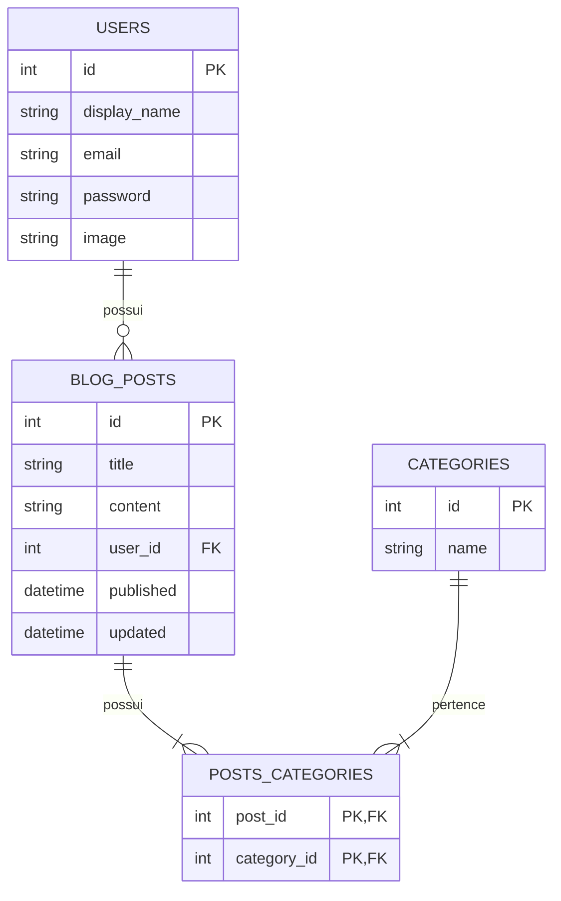

# Blogs API 📝

Uma API RESTful robusta e escalável desenvolvida em **Node.js com TypeScript**, aplicando arquitetura em camadas **MSC (Model-Service-Controller)**, persistência com **Sequelize ORM** e banco de dados **MySQL**, autenticação segura via **JWT** e documentação interativa com **Swagger (OpenAPI 3.0)**.

---

## 🚀 Tecnologias e Ferramentas


---

## 📌 Destaques do Projeto

- **Arquitetura em Camadas (MSC):** Separação rigorosa de responsabilidades entre regras de negócio (*Services*), orquestração de requisições (*Controllers*) e persistência de dados (*Models*).
- **Tipagem Estrita com TypeScript:** Interfaces e DTOs definidos para garantir previsibilidade em payloads, queries e parâmetros.
- **Autenticação & Autorização JWT:** Geração de token stateless, proteção de rotas com middleware de autenticação e validação de autoria para modificação e exclusão de posts.
- **Relacionamentos no Banco de Dados (ORM):** Modelagem de relacionamentos `1:N` (*User -> BlogPosts*) e `N:N` (*BlogPosts <-> Categories*) utilizando tabela de junção intermediária.
- **Paginação de Recursos:** Endpoint de listagem de posts otimizado para grandes volumes com suporte a `?page=X&limit=Y`.
- **Documentação Interativa (Swagger UI):** Teste de todos os endpoints diretamente pelo navegador com suporte a inserção do token Bearer JWT.

---

## 📖 Documentação da API (Swagger)

Com a aplicação rodando, acesse a documentação interativa:

👉 **[http://localhost:3000/api-docs](http://localhost:3000/api-docs)**

Na interface do Swagger você pode:
1. Realizar o cadastro (`POST /user`) ou login (`POST /login`).
2. Copiar o token retornado.
3. Clicar no botão verde **Authorize** no topo do Swagger e colar o token no formato `Bearer seu_token`.
4. Executar e testar todas as rotas protegidas em tempo real diretamente pelo navegador.

---

## 🏛️ Arquitetura do Banco de Dados

O banco de dados relacional é estruturado conforme o diagrama:



---

## 🛠️ Como Executar o Projeto

### Pré-requisitos
- [Docker](https://www.docker.com/) e [Docker Compose](https://docs.docker.com/compose/) instalados (Recomendado).
- Ou [Node.js](https://nodejs.org/) (v16+) e instância local do [MySQL](https://www.mysql.com/).

### Executando com Docker (Forma Rápida)

1. **Clone o repositório:**
   ```bash
   git clone git@github.com:Ludson96/project-blogs-api.git
   cd project-blogs-api
   ```

2. **Configure as variáveis de ambiente:**
   Copie o arquivo de exemplo para `.env`:
   ```bash
   cp .env.example .env
   ```

3. **Inicie os serviços com Docker Compose:**
   ```bash
   docker-compose up -d
   ```

4. **Acesse o container da aplicação:**
   ```bash
   docker exec -it blogs_api bash
   ```

5. **Execute as migrações e seeders:**
   ```bash
   npm run prestart
   npm run seed
   ```

6. **Inicie a aplicação:**
   ```bash
   npm start
   # Ou para desenvolvimento com hot-reload:
   npm run dev
   ```

A API estará disponível em `http://localhost:3000`.

---

## 🧪 Scripts Disponíveis

| Comando | Descrição |
| :--- | :--- |
| `npm run dev` | Inicia o servidor em modo de desenvolvimento com `ts-node-dev` (hot-reload) |
| `npm run build` | Compila o projeto TypeScript para a pasta `dist/` |
| `npm start` | Inicia a aplicação executando o código compilado em produção |
| `npm run lint` | Executa o linter para validação estática de padrões de código |
| `npm run prestart` | Executa `db:create` e `db:migrate` via Sequelize CLI |
| `npm run seed` | Popula o banco com os seeders iniciais |

---

## 📍 Principais Endpoints

| Método | Endpoint | Protegido | Descrição |
| :--- | :--- | :---: | :--- |
| `POST` | `/login` | ❌ | Autentica usuário e retorna JWT |
| `POST` | `/user` | ❌ | Cadastra um novo usuário |
| `GET` | `/user` | ✅ | Lista todos os usuários cadastrados |
| `GET` | `/user/:id` | ✅ | Obtém detalhes de um usuário por ID |
| `DELETE` | `/user/me` | ✅ | Exclui a própria conta logada |
| `GET` | `/categories` | ✅ | Lista todas as categorias |
| `POST` | `/categories` | ✅ | Cria uma nova categoria |
| `GET` | `/post` | ✅ | Lista posts (suporta `?page=1&limit=10`) |
| `GET` | `/post/:id` | ✅ | Obtém detalhes de um post específico |
| `GET` | `/post/search?q=termo`| ✅ | Busca posts por título ou conteúdo |
| `POST` | `/post` | ✅ | Cria uma nova publicação |
| `PUT` | `/post/:id` | ✅ | Edita publicação (apenas autor) |
| `DELETE` | `/post/:id` | ✅ | Remove publicação (apenas autor) |

---

## 👤 Autor

Desenvolvido por **Ludson**  
- [GitHub](https://github.com/Ludson96)
